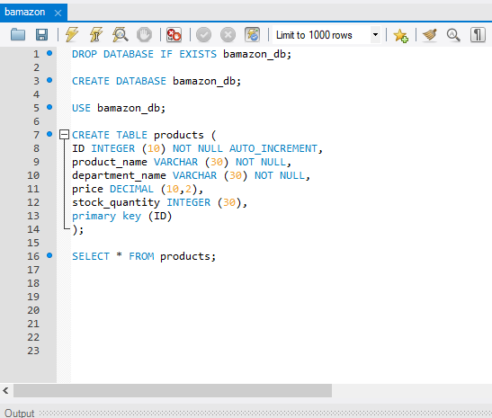
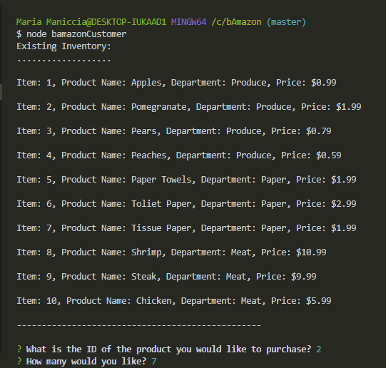
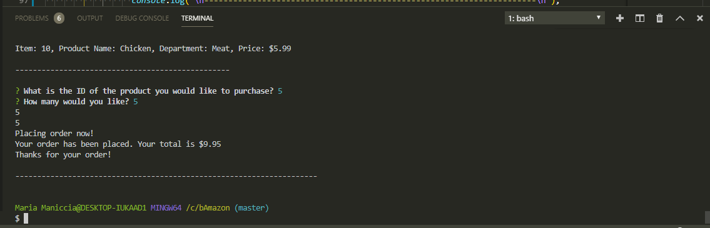
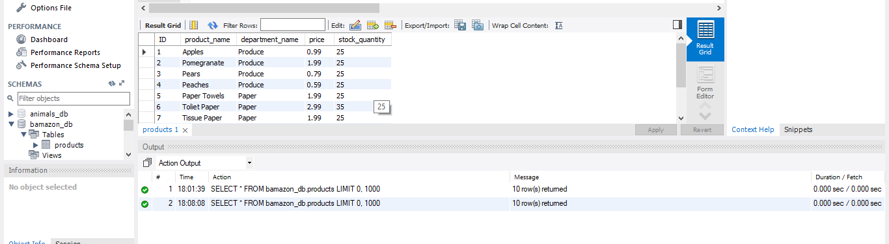
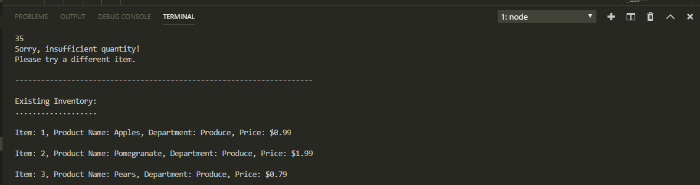

<h1>bAmazon</h1>

<h3>Here I created an Amazon-like storefront with MySQL. The app will take in orders from customers and deplete stock from the store's inventory. As a bonus task, you can track product sales across your store's departments and then provide a summary of the highest-grossing departments in the store.</h3>

<h2>Here are the instructions::</h2>

1) Create a MySQL Database 

 

2) Once the app has begun, it will display the items in the store the ask two questions:
The first should ask them the ID of the product they would like to buy.
The second message should ask how many units of the product they would like to buy.

 

3) Once the customer has placed the order, the app will check if the store has enough of the product to meet the customer's request.

The database is also updated at that time.

If not, the app should then prevent the order from going through.

 

