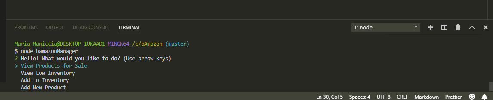
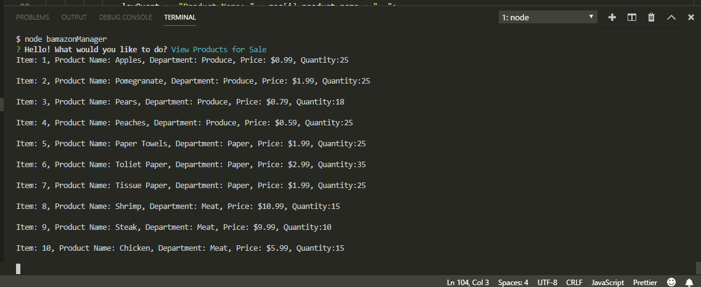
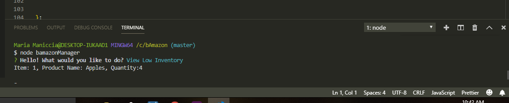
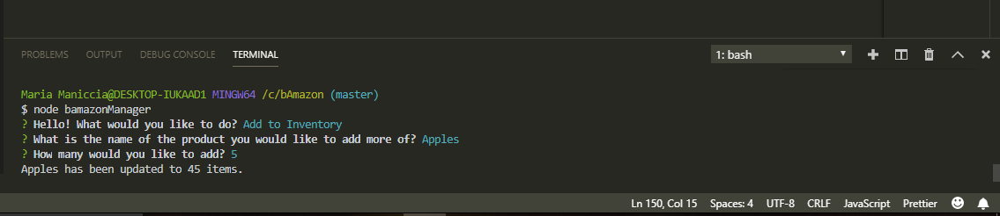
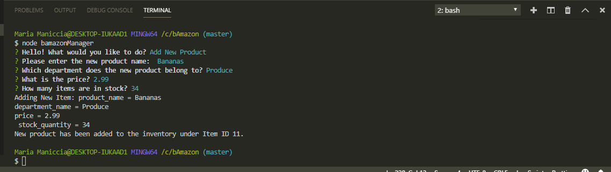

<h1>bAmazon</h1>

<h3>Here I created an Amazon-like storefront with MySQL. The app will take in orders from customers and deplete stock from the store's inventory. As a bonus task, you can track product sales across your store's departments and then provide a summary of the highest-grossing departments in the store.</h3>

<h2>Here are the instructions::</h2>

<h3>When running the bamazonCustomer page</h3>
1) Create a MySQL Database 

 

2) Once the app has begun, it will display the items in the store the ask two questions:
The first should ask them the ID of the product they would like to buy.
The second message should ask how many units of the product they would like to buy.

 

3) Once the customer has placed the order, the app will check if the store has enough of the product to meet the customer's request.

The database is also updated at that time.

If not, the app should then prevent the order from going through.

 
 

<h3>When running the bamazonManager page</h3>
 
<h4>Pick from a selection of options on this page!</h4>

 
1) If a manager selects View Products for Sale, the app can list every available item: the item IDs, names, prices, and quantities.

 
2) If a manager selects View Low Inventory, then it should list all items with an inventory count lower than five.

 
3) If a manager selects Add to Inventory, the app will display a prompt that will let the manager "add more" of any item currently in the store.

 
4) If a manager selects Add New Product, it will allow the manager to add a completely new product to the store.

 

Thank you to everyone involved!

